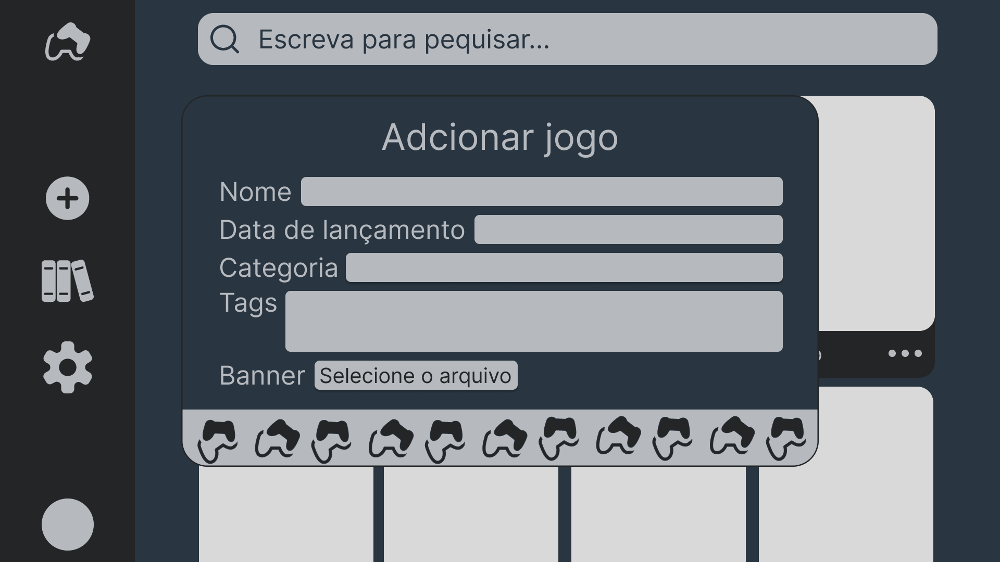

# GT5 - Gestor de jogos


---

O GT5 é um gestor de jogos bem simples que está sendo desenvolvido como um projeto escolar para a disciplina de **Algoritmia e Estrutura de Dados** para o **[Instituto Pólitécnico do Porto](https://www.ipp.pt/)**.

## Recursos
### Gerenciamento de usuarios
O GT5 é capaz de gerenciar varias contas numa unica instalação.
Para criar uma conta clica no icone no canto inferior esquerdo. A clicar um popup será aberto pedindo o login.

Podes fazer login como usuario _admin_ com a palavra-passe padrão de **1234** caso seja uma instalação limpa do programa ou podes criar uma nova conta clicando em criar nova conta.

Ao criar uma conta por padrão o usuario não tem nenhuma permissão especial (como criar novas categorias).

### Gerenciamento de jogos
O proposito doo GT5 de gerenciar os seus jogos, para isso basta criar uma conta e clicar no _simbolo de mais_ no canto esquerdo para adcionar os seus jogos.

Depois de adcionado o jogo já aparece na sua biblioteca e podes eventualmente deletar, comentar e adcionar aos favoritos.

### Comunidade
Caso outro usuario tenha adcionado um jogo previamente podes simplesmente adcionar este a sua coleção ao inves de ter que fazer todo o processo de criar o jogo.

## Estado
Este programa ainda está em desenvolvento.

## Utilização
### Linux e Mac
Clone o repositorio:
```
$ git clone https://github.com/rocha1202/TrabalhoPratico_AED

$ cd TrabalhoPratico_AED
```
Execute no seu terminal o script _build.sh_:
```
$ chmod +x build.sh

$ ./build.sh
```

### Windows
Primeiro baixe o linux, depois instale-o e execute os passo acima :).
Brincadeiras a parte, o script para windows será provido em breve.

---
**Tecnologias e Sistemas de Informação para Web**
